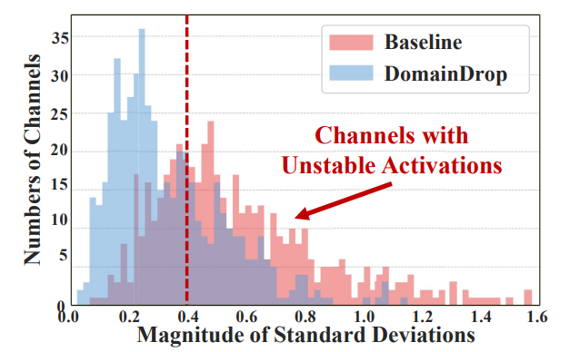
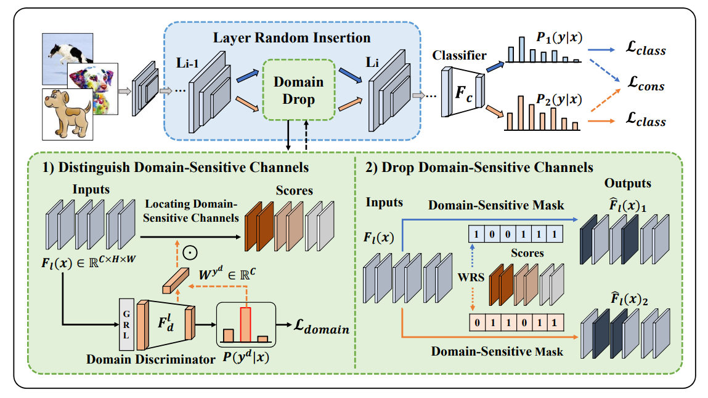
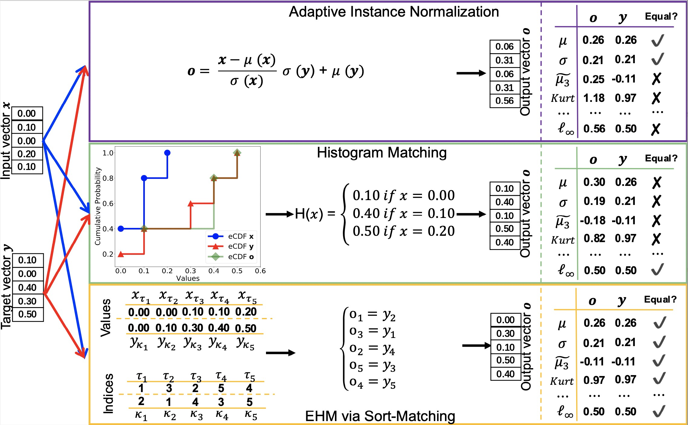
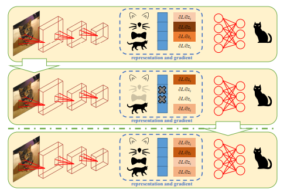
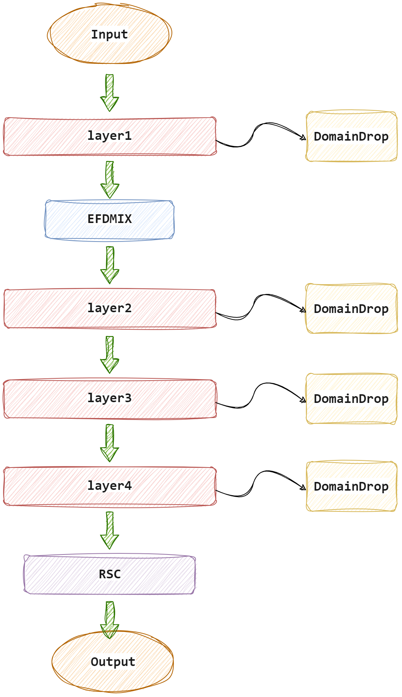

# DG_model

## repo概述
本仓库为本人23年SIGS大数据机器学习课程大作业材料整理，大作业题目为域泛化 (Domain Generalization, DG)任务，即让模型从具有不同数据分布(不同域)的数据上学习到一个泛化能力更强的模型，使得模型能够在未知域的数据上依然具有较好的效果。  
详细的任务要求与数据介绍见[大作业kaggle](https://www.kaggle.com/competitions/big-datamachine-learning-dg-competition/overview)

## 工作概述
非cs科班出身，代码功底极差。大作业主要整合(缝合)了三篇域泛化论文的创新点，有幸刷到了一个还不错的排名。
### ICCV 2023 | DomainDrop
这篇论文提出，在源域上训练的模型包含大量不鲁棒的通道。这些通道对不同领域展现出不稳定的激活值，倾向于捕捉领域相关特征，因此在面对未见过的目标领域时产生异常的激活值，导致出现结果的误判。为了解决这个问题，论文提出了DomainDrop框架，通过在前向传播过程中，引入领域鉴别器来识别并丢弃特征图中每个网络层中的不稳定通道，持续地增强通道对领域偏移的鲁棒性。

DomainDrop中构建的领域判别器如下图所示，通过区分并抑制跨域敏感通道，依概率显式移除领域敏感通道，可以有效降低通道对领域偏移的敏感性。

### CVPR 2022 | EFDM
这篇论文指出，许多现实世界的任务（例如，任意风格迁移和领域泛化）可以转化为特征分布匹配问题。在高斯特征分布的假设下，传统的特征分布匹配方法通常匹配特征的均值和标准差。然而，现实世界数据的特征分布通常比高斯分布复杂得多，仅使用一阶和二阶统计量无法准确匹配，而使用高阶统计量进行分布匹配在计算上又无法实现。故在这篇论文的工作中，他们通过精确匹配图像特征的经验累积分布函数（eCDF）来执行精确特征分布匹配（EFDM），这可以通过在图像特征空间中应用精确直方图匹配来实现（EHM）。而这种匹配高阶统计数据的方式，优于仅匹配一阶和二阶统计数据的 AdaIN。

### ECCV 2020 | Self-Challenging Improves Cross-Domain Generalization
这篇论文指出，我们使用卷积神经网络（CNN）通过激活与标签相关的主要特征来进行图像分类。当训练和测试数据分布相似时，它们的主要特征相似，从而导致了不错的测试性能。然而，对于域泛化问题，使用不同分布的数据进行测试时，性能未能达到预期，从而导致了跨域图像分类的挑战。作者引入了一个简单的训练启发式方法，称为表示自我挑战（RSC），它显著提高了CNN对于域外数据的泛化能力。RSC通过迭代地挑战（丢弃）在训练数据上激活的主要特征，并迫使网络激活与标签相关的剩余特征。这个过程似乎激活了适用于域外数据的特征表示，而不需要事先了解新域，也不需要学习额外的网络参数。

## 最终模型架构
本次实验首先采用Resnet+RSC+EFDMIX跑出了基本的结果，分别对应Resnet18和Resnet34，以及Resnet50骨干网络的结果，然后使用Resnet18与RSC+EFDMIX+DomainDrop全部结合在一个模型中跑出了一些结果。最终结果为四个模型的平均融合输出，模型架构图如下。
 

## 小记
本次大作业主要重心放在了论文的阅读和对模型结构的修改尝试上，并未对训练涉及的超参数等进行寻优测试，也未对不同数据增强方式进行研究。并不是科班出身，也算是抛去学习中做的小demo外，本人第一个完成度较高的DeepLearning小项目吧，后续有时间仿照DomainDrop的代码结构重构一下代码，这个代码结构实在是太不优雅了🥹